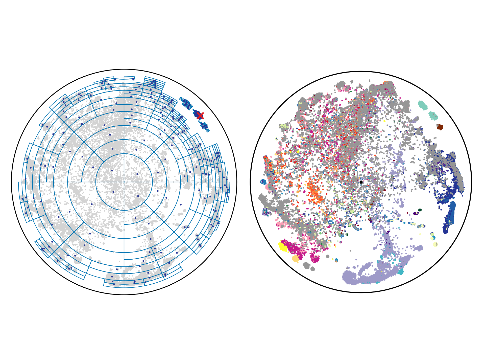

# Accelerating hyperbolic t-SNE

[](https://opensource.org/licenses/MIT)

This repository contains the code for the paper:
> Skrodzki, M., van Geffen, H., Chaves-de-Plaza, N.F., Höllt, T., Eisemann, E. and Hildebrandt, K., Accelerating hyperbolic t-SNE, 2024, IEEE TCVG (under revision).



If you use our code in your publications please consider citing:
```
@article{skrodzki2024hyperbolic,
    title={Accelerating hyperbolic t-SNE},
    author={Skrodzki, Martin and van Geffen, Hunter and Chaves-de-Plaza, Nicolas F. and H\"{o}llt, Thomas and Eisemann, Elmar and Hildebrandt, Klaus},
    journal={IEEE Transactions on Visualization and Computer Graphics},
    year={2024},
    volume={TODO},
    number={TODO},
    pages={TODO},    
    doi={TODO},
    eprint={TODO}
}
```

[Future link to paper]

## Setup

1. Install a conda (we recommend using [miniconda](https://docs.conda.io/projects/miniconda/en/latest/))
2. Create environment: `conda create --name=htsne python=3.9.16`
3. Activate environment: `conda activate htsne`
4. Install dependencies with pip: `pip install -r requirements.txt`
5. Build Cython extensions: `python setup.py build_ext --inplace`
6. Install hyperbolic-tsne package: `pip install .`
7. To test installation run `python -c "from hyperbolicTSNE import HyperbolicTSNE"`. No errors should be raised and you should see the output `Please note that 'empty_sequence' uses the KL divergence with Barnes-Hut approximation (angle=0.5) by default.`.

Note: on macOS, the build process of the Cython extensions might yield an error if it cannot find OpenMP.
This error can be ignored and the package will still be correctly installed and able to run. 
The main consequence of this error is that the optimization iterations are going to run slower.

After a successful installation of the repository's requirements, there are two ways to get started. 
First, `example_basic_usage.ipynb` offers a step-by-step guide showing how to use the `HyperbolicTSNE` package to embed a high-dimensional dataset. 
Second, the `example_different_params.py` script shows how to setup a script for quick experimentation. In this case, to compare the effect of different parameters.

## Data

You can run hyperbolic TSNE on your high-dimensional data. 
Nevertheless, the examples and experiments in this repository rely on specific datasets. 
Below, we provide downloading and processing instructions for each. 
We recommend putting all datasets in a `datasets` directory at the root of this repository.
The `load_data` function expects this path (`data_home`) to resolve the dataset.

Individual instructions per dataset:
- LUKK
- MYELOID8000
- PLANARIA: https://shiny.mdc-berlin.de/psca/ 
- MNIST
- WORDNET
- C_ELEGANS: https://data.caltech.edu/records/1945 

## Replicating the paper results

This folder contains three types of files:
- Scripts to generate experimental data via embedding different data sets into hyperbolic space. These are pre-fixed with "data generation". 
- Scripts to create plots from the data, as they appear in the publication.
- Scripts to create tables from the data, as they appear in the publication.

The general workflow to reproduce the results from the paper is:
- Run the scripts to generate data.
- Run the scripts to plot the data.
- Run the scripts to generate tables.

Note that the data generation scripts assume a top-level folder, i.e., a folder next to "examples", "experiments", etc., called "datasets" that holds the datasets to be embedded.

## License and third-party software
The source code in this repository is released under the MIT License. However, all used third-party software libraries are governed by their own respective licenes. Without the following libraries, this project would have been considerably harder: 
[scipy](https://scipy.org),
[numpy](https://numpy.org),
[scikit-learn](https://scikit-learn.org/stable/),
[hnswlib](https://github.com/nmslib/hnswlib),
[pandas](https://pandas.pydata.org),
[anndata](https://anndata.readthedocs.io/en/latest/),
[seaborn](https://seaborn.pydata.org),
[setuptools](https://github.com/pypa/setuptools),
[Cython](https://cython.org),
[tqdm](https://github.com/tqdm/tqdm),
[ipykernel](https://ipython.org).
